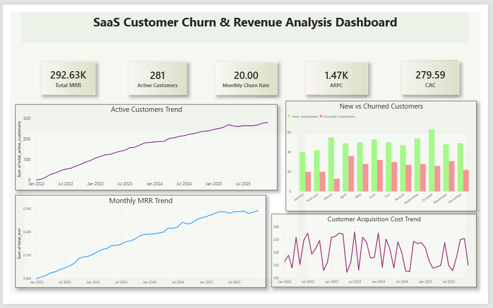
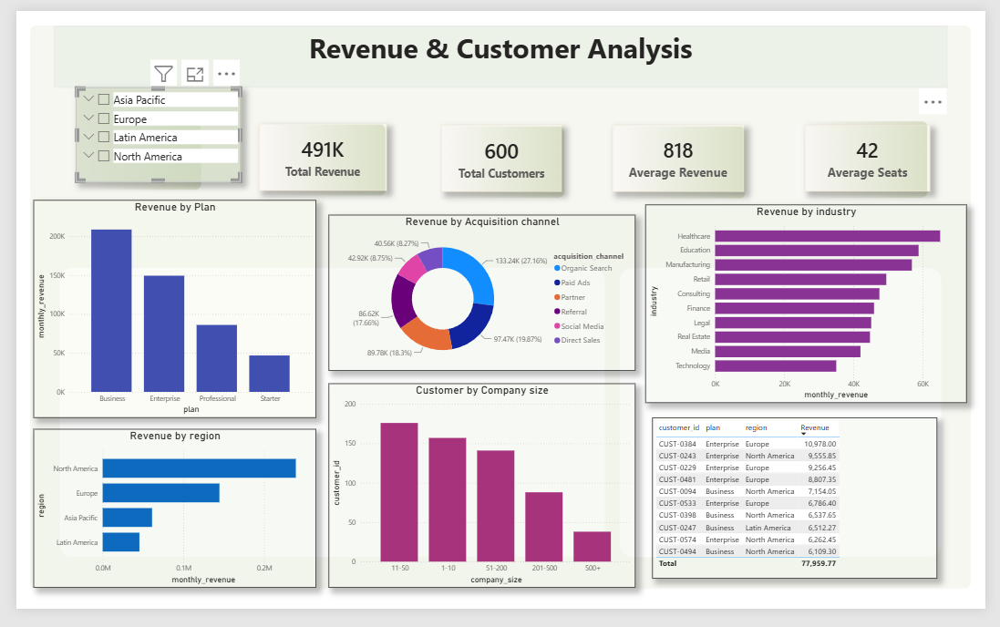

# 📊 SaaS Customer Churn & Revenue Analysis Dashboard

## 📌 Project Overview

This project analyzes a SaaS (Software as a Service) company's customer subscription data to understand business performance, 
revenue trends, customer behavior, and churn patterns.

The project was completed using SQL for data analysis and Power BI for interactive dashboard development. 
The goal was to help business stakeholders identify revenue opportunities and understand the factors contributing to customer churn.

---

# 🎯 Business Objectives

- Analyze Monthly Recurring Revenue (MRR) trends.
- Monitor customer growth and churn over time.
- Identify the highest revenue-generating plans and regions.
- Analyze customer distribution across industries and company sizes.
- Discover the major reasons for customer churn.
- Provide business insights to improve customer retention.

---

# 📂 Dataset

The project uses two datasets:

### 1. Monthly Revenue
Contains monthly business KPIs such as:
- Active Customers
- New Customers
- Churned Customers
- Monthly Churn Rate
- Monthly Recurring Revenue (MRR)
- Average Revenue per Customer
- Customer Acquisition Cost (CAC)

### 2. Customer Subscriptions
Contains customer-level information including:
- Customer ID
- Company
- Industry
- Region
- Subscription Plan
- Monthly Revenue
- Company Size
- Seats
- Feature Usage %
- NPS Score
- Support Tickets
- Signup Date
- Churn Status
- Churn Reason
- Upgrade Status

---

# 🛠️ Tools & Technologies

- Microsoft Excel (Data Cleaning)
- SQL Server (Data Analysis)
- Power BI (Dashboard Development)
- DAX (Calculated Measures)

---

# 📈 SQL Analysis

Business questions solved using SQL include:

- Total Customers
- Active Customers
- Churned Customers
- Churn Rate
- Revenue by Plan
- Revenue by Region
- Revenue by Industry
- Top Revenue Customers
- Average Revenue per Customer
- Customer Lifetime
- Upgrade Analysis
- Feature Usage Analysis
- Monthly Growth Trends

---

# 📊 Power BI Dashboard

The dashboard consists of three pages.

## Page 1 — Executive Overview

Provides a high-level overview of business performance including:

- Total MRR
- Active Customers
- New Customers
- Churn Rate
- Monthly Revenue Trend
- Customer Growth Trend
- Customer Acquisition Cost Trend

---

## Page 2 — Revenue & Customer Analysis

Focuses on revenue distribution and customer segmentation.

Includes:

- Revenue by Subscription Plan
- Revenue by Region
- Revenue by Industry
- Revenue by Acquisition Channel
- Customers by Company Size
- Top Revenue Customers

---

## Page 3 — Customer Churn Analysis

Provides insights into customer churn.

Includes:

- Churned Customers
- Churn Rate
- Average NPS Score
- Average Feature Usage
- Churn by Plan
- Churn by Region
- Churn Reasons
- Feature Usage by Churn Status

---

# 📌 Key Business Insights

- Business and Enterprise plans generated the highest revenue.
- North America contributed the largest share of total revenue.
- Medium-sized companies represented the largest customer segment.
- Customers with lower feature usage were more likely to churn.
- Churn reasons highlighted opportunities to improve customer retention.
- Executive KPIs helped monitor overall SaaS business performance.

---

# 📷 Dashboard Preview

## Executive Overview

---

## Revenue & Customer Analysis

---

## Customer Churn Analysis

---

# 🚀 Project Outcome

This project demonstrates end-to-end data analytics skills including:

- Data Cleaning
- SQL Query Writing
- Business Analysis
- DAX Calculations
- Data Visualization
- Dashboard Design
- Business Storytelling

---

# 👨‍💻 Author

**Piyusha Chavan**

Aspiring Data Analyst

Skills:
- SQL
- Excel
- Power BI
- DAX
